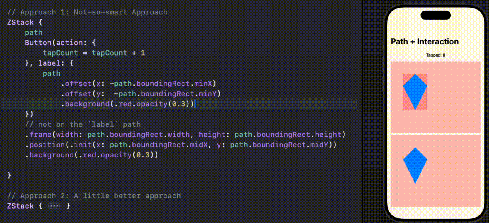

# SwiftUI_AddInteractionToPath
Two approaches in Adding interaction to path, for example, as button or as menu.

For more details, please refer to my article [Little SwiftUI Tip: Adding Interactions to Path]()

